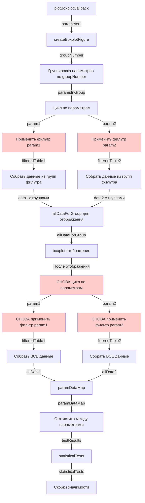
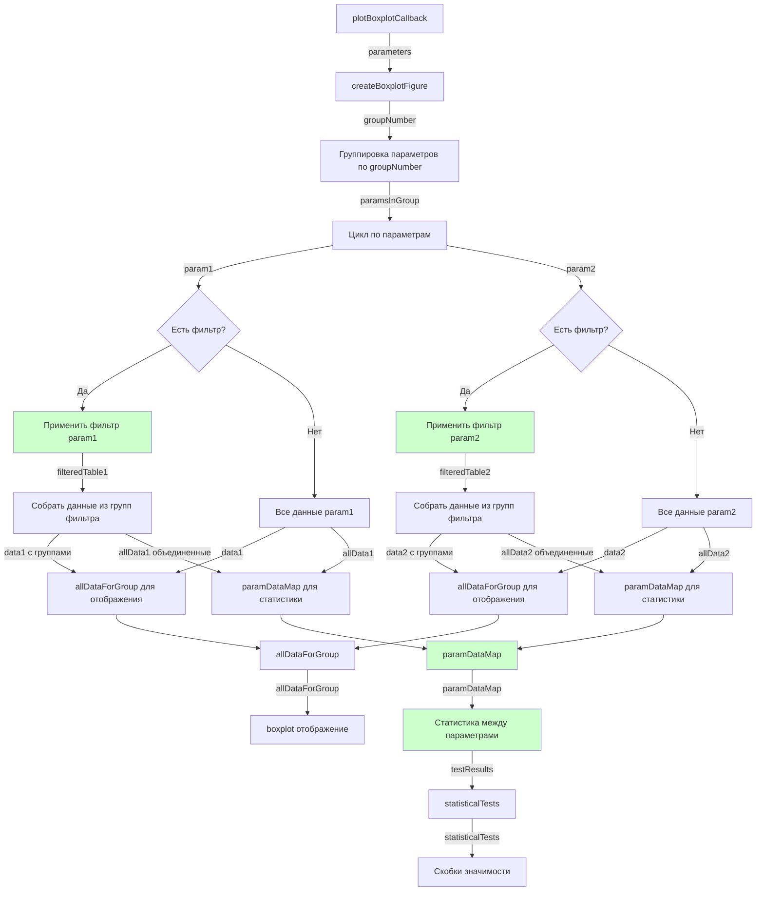

# Исправление логики фильтрации и статистики

## Проблема

Сейчас фильтрация применяется дважды (для отображения и для статистики), что создает дублирование.

## Текущий dataflow (КАК СЕЙЧАС):

**Проблемы:**

- Фильтры применяются дважды (красные блоки)
- Дублирование кода
- Путаница с группами из фильтров

## Новый dataflow (КАК БУДЕТ):

**Преимущества:**

- Фильтры применяются один раз (зеленые блоки)
- Нет дублирования
- Четкое разделение: данные для отображения (с группами) и данные для статистики (объединенные)

## Изменения в коде

### В `createBoxplotFigure` (строки 1080-1320):

1. **Убрать дублирование фильтрации** (строки 1213-1289)
2. **В цикле по параметрам** (1080-1176):

   - Применить фильтр один раз
   - Собрать данные для отображения (с группами из фильтра)
   - Собрать все данные для статистики (объединенные)

3. **После цикла**:

   - Вычислить статистику между параметрами из `paramDataMap`
   - Сохранить в `statisticalTests`

4. **Отобразить скобки** используя `statisticalTests`

### Файлы для изменения

- `functions/boxpl