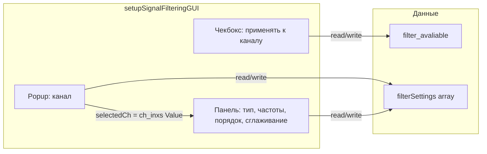

# План: настройки фильтра по каналам и выпадающий список в GUI

## Цель

1. **Данные:** хранить настройки фильтра **по каналам** — `filterSettings(1:numChannels)` (массив структур), в том же файле `_channelSettings.stn`.
2. **GUI:** заменить таблицу каналов с чекбоксами на **выпадающий список** «канал»; одна панель настроек привязана к выбранному каналу.

---

## 1. Модель данных

### 1.1 Текущее состояние

- В `.stn` сохраняются `filter_avaliable` (логический вектор по каналам) и одна структура `filterSettings` с полями: filterType, freqLow, freqHigh, order, smoothSpan, smoothMethod, filterEnabled, smoothEnabled, channelsToFilter.
- Все вызовы `applyFilter(data, filterSettings, newFs)` передают одну и ту же структуру для всех столбцов `data`.

### 1.2 Целевое состояние

- **filterSettings** — массив структур длины `numChannels`: `filterSettings(ch)` содержит настройки для канала `ch` (те же поля, без `channelsToFilter`).
- **filter_avaliable** — без изменений: логический вектор «применять ли фильтр к каналу ch».

Обратная совместимость при загрузке: если из файла загружена одна структура (не массив), размножить её на все каналы:  
`filterSettings = repmat(loadedSettings.filterSettings, 1, numChannels);` (или цикл присвоения по полям).

---

## 2. Загрузка и сохранение

### 2.1 [load_zav_file.m](functions/load_zav_file.m) — load_channel_settings

- После присвоения `filterSettings = loadedSettings.filterSettings` проверить: если это одна структура (не массив по полю или по размеру), то  
`numCh = length(channelNames);` (или length(defaultChannelNames) в ветке без EV_version),  
затем размножить: создать массив структур и заполнить каждую из загруженной (например, цикл `for ch = 1:numCh`, `filterSettings(ch) = loadedSettings.filterSettings;` с копированием полей).
- Дополнительно при отсутствии полей у загруженной структуры подставлять smoothSpan/smoothMethod/filterEnabled/smoothEnabled по умолчанию (как сейчас для одной структуры).

### 2.2 [load_zav_file.m](functions/load_zav_file.m) — create_default_channel_settings

- Вместо одной структуры создавать массив:  
`for ch = 1:length(defaultChannelNames)`, задать все поля для `filterSettings(ch)` (filterType, freqLow, freqHigh, order, smoothSpan, smoothMethod, filterEnabled, smoothEnabled);  
`filterSettings(ch).channelsToFilter` не хранить в элементе массива (общий флаг — filter_avaliable).

### 2.3 [setupSignalFilteringGUI.m](functions/GUIfunctions/setupSignalFilteringGUI.m) — Apply

- Сохранять в файл массив `filterSettings` и `filter_avaliable` как сейчас (без изменения списка переменных в save).

### 2.4 Остальные места загрузки/дефолтов filterSettings

- **[signalViewerGUI.m](functions/GUIfunctions/signalViewerGUI.m)** (загрузка .stn, fallback при отсутствии filterSettings): после загрузки приводить filterSettings к массиву длины numChannels (если пришла одна структура — размножить). При создании дефолта — массив структур.
- **[signalAnalysisGUI.m](functions/GUIfunctions/signalAnalysisGUI.m)** (аналогично при loadSettingsFile и при дефолте): то же — ожидать/создавать массив filterSettings.
- **[loadGroupSettingsAndCreateIndividual.m](functions/loadGroupSettingsAndCreateIndividual.m)**, **[ICAazGUI.m](functions/GUIfunctions/ICAazGUI.m)**, **[PCAazGUI.m](functions/GUIfunctions/PCAazGUI.m)**, **[performChannelOperationsGUI.m](functions/GUIfunctions/performChannelOperationsGUI.m)** — везде, где создаётся дефолтный `filterSettings`, создавать массив длины numChannels.

---

## 3. applyFilter и вызовы

### 3.1 Вариант A (рекомендуемый): опциональный 4-й аргумент

- Сигнатура:  
`applyFilter(data, filterSettings, Fs)` — как сейчас: один struct, применяется ко всем столбцам (обратная совместимость).  
`applyFilter(data, filterSettings, Fs, channelIndices)` — `channelIndices` вектор длины `size(data,2)`; для столбца `j` использовать `filterSettings(channelIndices(j))`.
- Внутри applyFilter: если `nargin >= 4` и задан `channelIndices`, цикл по столбцам: для каждого `j` вызывать текущую логику фильтрации/сглаживания с `filterSettings(channelIndices(j))` и записывать результат в соответствующий столбец `filteredData`. Иначе — текущее поведение (один filterSettings на все столбцы).

### 3.2 Вариант B: цикл в вызывающем коде

- Оставить `applyFilter(data, filterSettings, Fs)` с одной структурой.
- В каждом месте вызова, где раньше делали `data(:, ch_to_filter) = applyFilter(data(:, ch_to_filter), filterSettings, newFs)`, заменить на цикл по каналам: для каждого индекса канала из `ch_to_filter` брать один столбец, вызывать `applyFilter(..., filterSettings(ch), ...)` и записывать обратно.

Вариант A уменьшает дублирование и централизует логику «массив настроек по столбцам» в одном месте.

### 3.3 Места вызова (передать индексы каналов при варианте A)

| Файл                                                                      | Текущий вызов                                                                                              | После изменений                                                                                                                                                                                                                                                                |
| ------------------------------------------------------------------------- | ---------------------------------------------------------------------------------------------------------- | ------------------------------------------------------------------------------------------------------------------------------------------------------------------------------------------------------------------------------------------------------------------------------ |
| [updatePlot.m](functions/updatePlot.m)                                    | `data(:, ch_to_filter) = applyFilter(data(:, ch_to_filter), filterSettings, newFs)`                        | Передать индексы каналов для отфильтрованных столбцов: столбцы `data` соответствуют `ch_inxs`, значит отфильтрованные столбцы — `ch_inxs(ch_to_filter)`; вызов `applyFilter(data(:, ch_to_filter), filterSettings, newFs, ch_inxs(ch_to_filter))`.                             |
| [getSignalDataForResult.m](functions/getSignalDataForResult.m)            | Один канал `selected_channel`; `applyFilter(signal_data, filterSettings, newFs)`                           | `applyFilter(signal_data, filterSettings, newFs, selected_channel)` или оставить два аргумента, если по 4-му аргументу подставлять filterSettings(selected_channel) на уровне одной структуры (тогда внутри applyFilter при nargin==4 использовать filterSettings как массив). |
| [addExtraEvent.m](functions/addExtraEvent.m)                              | `data(:, ch_to_filter) = applyFilter(data(:, ch_to_filter), filterSettings, newFs)`                        | Столбцы соответствуют `ch_inx`; вызов с 4-м аргументом `ch_inx(ch_to_filter)` (индексы каналов для переданных столбцов).                                                                                                                                                       |
| [autoEventDetectionGUI.m](functions/GUIfunctions/autoEventDetectionGUI.m) | Аналогично                                                                                                 | Передать индексы каналов для отфильтрованных столбцов (как в updatePlot, в зависимости от того, как там формируется data и ch_to_filter).                                                                                                                                      |
| [calculateMeanEvents.m](functions/calculateMeanEvents.m)                  | Два случая: один канал `params.channel_index_original` и многоканальный `params.lfp(:, filter_avaliable)`. | Для одного канала: `applyFilter(params.lfp, filterSettings(params.channel_index_original), newFs)` (одна структура). Для нескольких: `applyFilter(..., filterSettings, newFs, find(filter_avaliable))` (индексы каналов для столбцов params.lfp).                              |
| [calculateAndPlotMeanEvents.m](functions/calculateAndPlotMeanEvents.m)    | `params.lfp(:, ch_to_filter) = applyFilter(..., filterSettings, newFs)`                                    | Передать 4-й аргумент — индексы каналов, соответствующие столбцам ch_to_filter (т.е. `find(filter_avaliable)` или аналог в контексте params).                                                                                                                                  |

Уточнение по индексам: везде, где `data` имеет столбцы, соответствующие подмножеству каналов, 4-й аргумент должен быть вектор глобальных индексов каналов (1..numChannels) в том же порядке, что и столбцы переданной матрицы.

---

## 4. GUI: setupSignalFilteringGUI — выпадающий список вместо таблицы

### 4.1 Удалить

- uitable с таблицей каналов (Channel / Enabled).
- Кнопки «Select ALL» и «Deselect ALL».
- Callback `checkbtns` (реакция на изменение ячеек таблицы).

### 4.2 Добавить

- **Выпадающий список (popup)** в верхней части правой колонки (или слева над областью графика): элементы — имена каналов текущего набора, т.е. `channelNames(ch_inxs)`. Значение popup — номер выбранного элемента (1..length(ch_inxs)); по нему вычислять **глобальный** индекс канала: `selectedCh = ch_inxs(hChannelPopup.Value)` (или хранить в UserData маппинг value → ch).
- Чекбокс **«Применять к этому каналу»** (или «Включить фильтр для канала»): привязан к `filter_avaliable(selectedCh)`. При смене канала в popup обновлять значение чекбокса из `filter_avaliable(selectedCh)`; при изменении чекбокса записывать в `filter_avaliable(selectedCh)` (локально в GUI; при Apply — в глобальную переменную и в файл).

### 4.3 Привязка панели настроек к выбранному каналу

- Все текущие элементы (чекбоксы «Фильтрация по частотам», «Сглаживание», popup типа фильтра, поля частот, порядка, сглаживания) относятся к **одному** выбранному каналу.
- При открытии окна: выбран первый канал в списке; заполнить поля из `filterSettings(selectedCh)` и чекбокс «Применять» из `filter_avaliable(selectedCh)`. Убедиться, что filterSettings при открытии уже массив (если пришла одна структура — размножить в начале setupSignalFilteringGUI для текущего numChannels).
- **Callback смены канала (popup):** прочитать из полей текущие значения и записать в `filterSettings(prevSelectedCh)` (и опционально в filter_avaliable(prevSelectedCh) из чекбокса); затем `selectedCh = ch_inxs(hChannelPopup.Value)`; загрузить в поля `filterSettings(selectedCh)` и в чекбокс «Применять» — `filter_avaliable(selectedCh)`. Так при переключении канала настройки сохраняются по каналу и подгружаются новые.
- Инициализация при первом открытии: если filterSettings ещё одна структура, выполнить размножение в массив по numChannels в начале функции (до создания контролов).

### 4.4 Check Filtration

- «Выбранные каналы» для графика — либо все каналы с filter_avaliable(ch_inxs)==true, либо только текущий выбранный в popup (логичнее текущий выбранный, чтобы видеть спектр именно этого канала). Подставлять `filterSettings(selectedCh)` в вызов applyFilter для отображения (один канал — одна структура).
- Линии частот и т.д. оставить как сейчас, по local_settings выбранного канала.

### 4.5 Apply

- Перед закрытием: записать из полей в `filterSettings(selectedCh)` и `filter_avaliable(selectedCh)` из чекбокса.
- Убедиться, что глобальный `filterSettings` — массив и `filter_avaliable` — вектор по всем каналам; сохранить в .stn оба.  
- Убрать присвоение `filterSettings.channelsToFilter = filter_avaliable` (или оставить только для обратной совместимости в одном месте, если где-то читается; в новой модели достаточно filter_avaliable).

### 4.6 Кнопка «Check Filtration» и активные каналы

- Либо оставить кнопку включённой, если хотя бы один канал в списке имеет filter_avaliable(ch)==true; либо всегда включена, т.к. мы всегда можем показать спектр для выбранного в popup канала (даже если «Применять» снят — тогда показывать исходный и «как будет после настроек»). На усмотрение: минимально — показывать превью для выбранного канала по его filterSettings(selectedCh).

### 4.7 Расположение элементов

- Сверху: выпадающий список каналов, под ним чекбокс «Применять к этому каналу».
- Далее без изменений: чекбоксы фильтрации/сглаживания, тип фильтра, частоты, порядок, сглаживание, кнопки Check Filtration, Apply, Cancel. При необходимости слегка сдвинуть блок вниз, чтобы всё помещалось (ось графика уже внизу).

---

## 5. Порядок реализации (краткий чек-лист)

1. **load_zav_file:** в load_channel_settings и create_default_channel_settings ввести массив filterSettings; при загрузке одной структуры — размножить на numChannels.
2. **applyFilter:** добавить опциональный 4-й аргумент channelIndices; при его наличии цикл по столбцам с filterSettings(channelIndices(j)).
3. **Все вызовы applyFilter:** обновить (передавать индексы каналов там, где данные многоканальные и настройки по каналам).
4. **setupSignalFilteringGUI:** в начале привести filterSettings к массиву (размножить, если одна структура). Заменить таблицу на popup + чекбокс «Применять к этому каналу»; при переключении канала сохранять/загружать настройки в/из filterSettings(ch) и filter_avaliable(ch); Apply сохраняет массив filterSettings и filter_avaliable; Check Filtration использует выбранный канал и его filterSettings(selectedCh).
5. **Остальные GUI и загрузчики:** signalViewerGUI, signalAnalysisGUI, loadGroupSettingsAndCreateIndividual, ICAazGUI, PCAazGUI, performChannelOperationsGUI — везде, где создаётся или загружается filterSettings, перейти на массив и при необходимости размножать одну структуру при загрузке.

---

## 6. Схема потока данных (GUI)

При переключении Popup: записать текущие значения полей в `filterSettings(prevCh)` и `filter_avaliable(prevCh)`; загрузить в поля `filterSettings(selectedCh)` и в ApplyCh — `filter_avaliable(selectedCh)`.