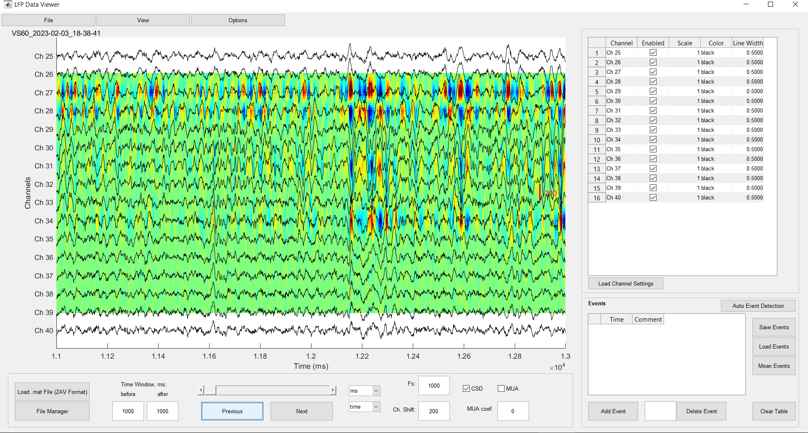
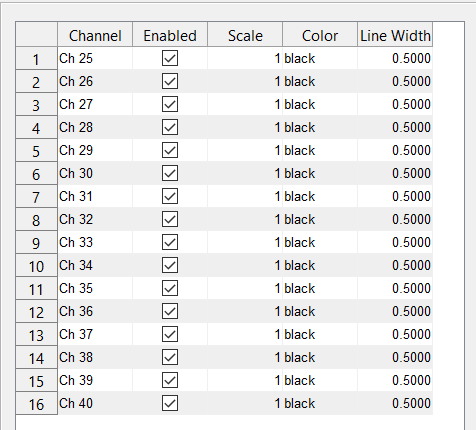

### Основное окно просмотра сигналов
Основное окно отображает многоканальные LFP сигналы. Пользователи могут наблюдать за активностью сигналов в разных каналах, что позволяет проводить визуальный анализ.

#### Настройки каналов
Боковая панель настроек каналов дает возможность выбора отображаемых каналов, масштабирования и изменения цветов для лучшего визуального различия сигналов.

#### Управление временем
Панель управления временем позволяет выбирать интересующий временной диапазон для детального просмотра, а также быстро перемещаться между различными сегментами данных.

#### Файловое меню
Файловое меню предлагает функции для открытия и обработки файлов данных, включая импорт из форматов ZAV и NLX, а также экспорт событий.

#### Меню просмотра
Меню "View" предоставляет опции для управления видимостью панелей, в том числе возможность скрыть настройки каналов для увеличения рабочего пространства.

### Функции обработки сигналов
В меню "Опции" доступны различные инструменты для обработки сигналов, включая автоматическое обнаружение событий, фильтрацию, отображение CSD и вычет среднего.

### Управление событиями
Инструменты для добавления, удаления и автоматического обнаружения событий на временных рядах LFP, а также для сохранения и загрузки этих событий.

