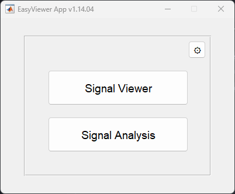

# Easy Viewer

[🇬🇧 English](README.md) | [🇷🇺 Русский](README_RU.md)

A program for viewing and analyzing electrophysiological signals.

## Table of Contents

- [Introduction](#introduction)
- [Getting Started](#getting-started)
- [Main Components](#main-components)
- [Detailed Documentation](#detailed-documentation)

## Introduction

Easy Viewer is designed for visualization and analysis of multi-channel electrophysiological signals (LFP). The program supports working with various data formats, provides tools for signal processing, event detection, parameter measurement, and analysis automation.

## Getting Started

### Launching the Application

Launch the application by running the `app()` command in the MATLAB command window. The main window opens with two main modes of operation:

- **Signal Viewer** - signal viewing mode
- **Signal Analysis** - analysis and parameter measurement mode

### Selecting Operation Mode

Press the **Signal Viewer** button to open the signal viewing window or **Signal Analysis** to open the analysis window. Both modes can work independently, but when one window opens, the other automatically closes.

The **⚙** button opens global application settings.

## Main Components

### Signal Viewer

The signal viewing window is designed for visualization of multi-channel LFP signals, management of events and stimuli, signal processing, and basic analysis.

Main features:
- Loading files in ZAV (.mat) and EV (.ev) formats
- Viewing multi-channel signals with display configuration
- Event management (manual addition, automatic detection)
- Stimulus management
- Signal processing (filtering, mean subtraction, CSD)
- Analysis tools (Z-score, spectral density, PCA, correlation)

Detailed description: [Signal Viewer](docs/signal_viewer_eng.md)

### Signal Analysis

The analysis window is designed for measuring signal parameters relative to stimuli or events.

Main features:
- Parameter measurement (slope, peak, onset, baseline)
- Working with measurement table
- Signal smoothing
- Saving results to Excel
- Hot Resave for automatic re-saving
- Viewing mean trace by measurements

Detailed description: [Signal Analysis](docs/signal_analysis_eng.md)

### File Manager

File manager with SQL database support for organizing projects, file groups, and metadata.

Main features:
- Creating and managing projects
- File grouping
- Metadata storage
- Running automation modules
- Viewing analysis results

Detailed description: [File Manager](docs/file_manager_eng.md)

## Detailed Documentation

### Main Components

- [Signal Viewer](docs/signal_viewer_eng.md) - signal viewing and event management
- [Signal Analysis](docs/signal_analysis_eng.md) - signal parameter measurement
- [File Manager](docs/file_manager_eng.md) - file and project management

### Processing and Analysis

- [Signal Processing](docs/signal_processing_eng.md) - filtering, CSD, mean subtraction
- [Analysis Tools](docs/analysis_tools_eng.md) - Z-score, spectral density, PCA, correlation
- [Events and Stimuli](docs/events_and_stimuli_eng.md) - event and stimulus management
- [Parameter Measurements](docs/measurements_eng.md) - slope, peak, onset, baseline

### Automation

- [Automation Modules](docs/modules_eng.md) - automated analysis through modules

### Data Work

- [Data Conversion](docs/data_conversion_eng.md) - conversion from various formats
- [Visualization](docs/visualization_eng.md) - display and graph settings
