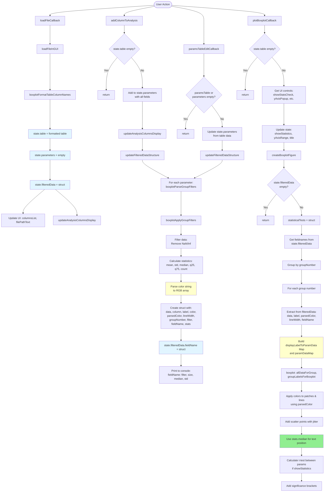

# Data Flow Diagram - boxplotFromTableGUI (Updated v3)

## Избыточные проверки полей (можно убрать):

### 1. **isfield(paramData, 'data')** (строка 879)
   - **Избыточно** - поле `data` всегда создается в `updateFilteredDataStructure`
   - **Можно заменить** на проверку `isempty(paramData.data)`

### 2. **isfield(paramData, 'label')** (строка 888)
   - **Избыточно** - поле `label` всегда создается в структуре параметра
   - **Можно убрать** проверку, оставить только `~isempty(paramData.label)`

### 3. **isfield(paramData, 'fieldName')** (строки 896, 936)
   - **Избыточно** - `fieldName` всегда добавляется в `updateFilteredDataStructure` (строка 776)
   - **Можно убрать** - использовать напрямую `paramData.fieldName`

### 4. **isfield(paramData, 'parsedColor')** (строка 916)
   - **Избыточно** - `parsedColor` всегда создается в `updateFilteredDataStructure` (строка 767)
   - **Можно убрать** - использовать напрямую `paramData.parsedColor`

### 5. **isfield(paramData, 'lineWidth')** (строки 921, 992, 1039)
   - **Избыточно** - `lineWidth` всегда создается в структуре параметра
   - **Можно убрать** проверку, оставить только `~isempty(paramData.lineWidth)` если нужно

### 6. **isfield(paramDataForLabel, 'lineWidth')** (строки 992, 1039)
   - **Избыточно** - `lineWidth` всегда есть в структуре
   - **Можно убрать** - использовать напрямую

### 7. **isfield(paramsInGroup{1}, 'column')** (строка 1109)
   - **Избыточно** - `column` всегда есть в структуре
   - **Можно убрать** проверку

### 8. **isfield(paramDataForLabel, 'stats') && isfield(paramDataForLabel.stats, 'median')** (строка 1058)
   - **Избыточно** - `stats` всегда создается в `updateFilteredDataStructure` (строка 777)
   - **Можно упростить** до `paramDataForLabel.stats.median` с проверкой на NaN

### 9. **isfield(paramData, 'groupNumber')** (строки 830, 848, 852)
   - **Частично избыточно** - `groupNumber` всегда создается в структуре параметра
   - **Можно упростить** - использовать напрямую с fallback на 1

## Рекомендации:

1. **Убрать проверки isfield** для полей, которые всегда создаются:
   - `data`, `label`, `fieldName`, `parsedColor`, `lineWidth`, `column`, `stats`
   
2. **Оставить проверки** только для:
   - `isempty()` - проверка на пустые значения
   - `isKey()` - проверка наличия ключа в Map
   - Условные поля, которые могут отсутствовать

3. **Использовать значения по умолчанию** вместо проверок:
   - `color = paramData.parsedColor;` вместо `if isfield(...)`
   - `paramLineWidth = paramData.lineWidth;` вместо проверки
