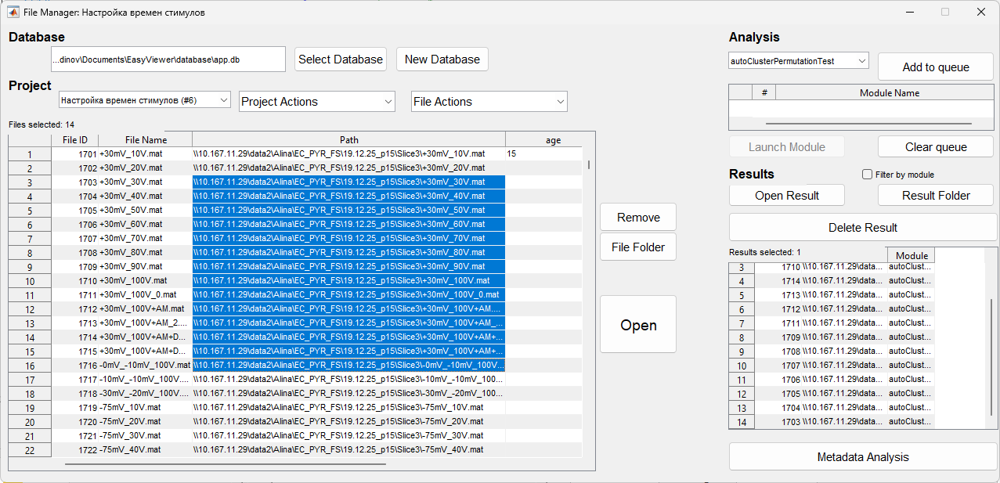

# File Manager

Файловый менеджер с поддержкой SQL базы данных для организации проектов, групп файлов и метаданных.

## Структура базы данных

File Manager использует SQLite базу данных для хранения информации о проектах, группах, файлах и результатах анализа.

### Таблицы базы данных

- **projects** - проекты
- **groups** - группы файлов внутри проектов
- **group_metadata** - метаданные групп
- **files** - файлы
- **project_files** - связь проектов и файлов (many-to-many)
- **file_metadata** - метаданные файлов
- **analysis_results** - результаты анализа модулей

Подробное описание схемы: [SQL Storage](sql_storage_eng.md)

## Выбор базы данных

В верхней части окна отображается путь к текущей базе данных. Кнопка **Select Database** позволяет выбрать существующую базу данных или создать новую.

## Проекты

### Создание проекта

Кнопка **New Project** открывает диалог создания нового проекта. Укажите название и описание проекта.

### Список проектов

Левая панель содержит список всех проектов в базе данных. Выбор проекта загружает его файлы и группы.

### Редактирование проекта

Выберите проект и используйте кнопку **Edit Project** для изменения названия и описания.

### Удаление проекта

Выберите проект и используйте кнопку **Delete Project** для удаления. Удаляются все связанные группы, файлы и результаты.

## Группы

### Создание группы

Кнопка **New Group** создает новую группу в текущем проекте. Укажите название группы.

### Список групп

Средняя панель содержит список групп в текущем проекте. Выбор группы фильтрует файлы по группе.

### Редактирование группы

Выберите группу и используйте кнопку **Edit Group** для изменения названия.

### Удаление группы

Выберите группу и используйте кнопку **Delete Group** для удаления. Файлы остаются в проекте, но теряют связь с группой.

### Метаданные группы

Кнопка **Group Metadata** открывает окно редактирования метаданных группы. Метаданные хранятся как пары поле-значение.

## Файлы

### Добавление файлов

Кнопка **Add File** открывает диалог выбора файлов. Выбранные файлы добавляются в текущий проект.

### Список файлов

Правая панель содержит список файлов в текущем проекте. Таблица показывает:

- Путь к файлу
- Название файла
- Группа (если назначена)
- Метаданные (если заданы)

### Назначение группы

Выберите файл(ы) в списке и используйте выпадающий список **Assign to Group** для назначения группы.

### Метаданные файла

Выберите файл и используйте кнопку **File Metadata** для редактирования метаданных файла.

### Удаление файла

Выберите файл и используйте кнопку **Remove File** для удаления из проекта. Файл остается в базе данных, но теряет связь с проектом.

### Открытие файла

Выберите файл и используйте кнопку **Open File** для открытия в Signal Viewer или Signal Analysis (в зависимости от контекста).

## Модули автоматизации

### Выбор модуля

Выпадающий список **Module** содержит доступные модули автоматизации:

- **autoClusterPermutationTest** - кластерный пермутационный тест
- **autoMeanStimulus** - усреднение по стимулам
- **autoDetectStimuli** - автоматическое обнаружение стимулов
- **autoSlopeMeasurement** - автоматическое измерение slope

### Настройка параметров модуля

Кнопка **Edit Module Params** открывает окно редактирования параметров выбранного модуля. Параметры сохраняются в JSON формате.

### Запуск модуля

Кнопка **Run Module** запускает выбранный модуль для выбранных файлов. Результаты сохраняются в базу данных и отображаются в списке результатов.

### Очередь модулей

Модули могут быть добавлены в очередь для последовательного выполнения. Кнопка **Add to Queue** добавляет текущую конфигурацию модуля в очередь.

## Результаты анализа

### Просмотр результатов

Выберите файл и используйте кнопку **View Results** для просмотра результатов анализа. Отображается список всех результатов для выбранного файла.

### Удаление результатов

Выберите результат и используйте кнопку **Delete Result** для удаления из базы данных.

## Импорт из Excel

Кнопка **Import from Excel** позволяет импортировать список файлов из Excel таблицы. Укажите колонку с путями к файлам.

## Экспорт

Кнопка **Export** позволяет экспортировать список файлов текущего проекта в Excel таблицу.

## Фильтрация и поиск

Поле **Search** позволяет фильтровать файлы по названию или пути.

## Настройки

Кнопка **Settings** открывает окно настроек File Manager:

- Путь к базе данных по умолчанию
- Настройки отображения
- Настройки модулей

