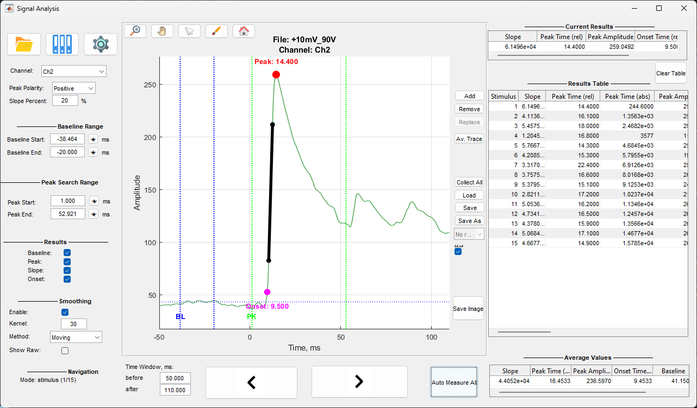

# Signal Analysis

Окно анализа предназначено для измерения параметров сигнала относительно стимулов или событий.

## Основное окно

Окно состоит из следующих элементов:

- **Графическая область** - отображение сигнала с маркерами измерений
- **Панель настроек измерений** - параметры расчета slope, peak, onset, baseline
- **Панель сглаживания** - настройки сглаживания сигнала
- **Таблица текущих результатов** - результаты для текущего измерения
- **Таблица результатов** - накопленные результаты измерений
- **Таблица средних значений** - средние значения по всем измерениям

## Загрузка файлов

### Загрузка ZAV файла

Кнопка **Open File** открывает диалог выбора ZAV файла. После загрузки файла отображается сигнал выбранного канала.

### Загрузка EV файла

Кнопка **Load Events** открывает диалог выбора EV файла. Загружаются LFP данные для событий и сами события.

### File Manager

Кнопка **File Manager** открывает файловый менеджер для работы с проектами и группами файлов.

## Настройки измерений

### Выбор канала

Выпадающий список **Channel** позволяет выбрать канал для анализа. При изменении канала график обновляется автоматически.

### Полярность пика

Выпадающий список **Polarity** определяет направление поиска пика:

- **Positive** - поиск положительного пика (максимума)
- **Negative** - поиск отрицательного пика (минимума)

### Процент для slope

Поле **Slope Percent** задает процент от амплитуды пика, используемый для расчета slope. Значение от 0 до 100.

### Baseline диапазон

Поля **Baseline Start** и **Baseline End** определяют временной диапазон для расчета базовой линии. Значения задаются в выбранных единицах времени относительно текущей точки отсчета.

Кнопка **★** рядом с полем позволяет выбрать точку на графике кликом мыши.

### Peak диапазон

Поля **Peak Start** и **Peak End** определяют временной диапазон для поиска пика. Значения задаются в выбранных единицах времени относительно текущей точки отсчета.

Кнопка **★** рядом с полем позволяет выбрать точку на графике кликом мыши.

### Временное окно

Поля **before** и **after** определяют размер временного окна отображаемого вокруг текущей точки. Значения задаются в выбранных единицах времени.

## Визуализация результатов

### Отображение элементов измерения

Чекбоксы в разделе **Results** управляют видимостью элементов на графике:

- **Baseline** - отображение диапазона базовой линии
- **Peak** - отображение диапазона поиска пика и маркера пика
- **Slope** - отображение линии регрессии slope
- **Onset** - отображение маркера онсета

### Таблица текущих результатов

Таблица показывает результаты для текущего измерения:

- **Slope** - значение slope
- **Peak Time (rel)** - время пика относительно точки отсчета
- **Peak Amplitude** - амплитуда пика
- **Onset Time (rel)** - время онсета относительно точки отсчета
- **Baseline** - значение базовой линии

## Сглаживание сигнала

### Включение сглаживания

Чекбокс **Enable** включает или выключает сглаживание сигнала перед расчетом измерений.

### Параметры сглаживания

- **Kernel** - размер ядра сглаживания (количество точек)
- **Method**:
  - **Moving** - скользящее среднее
  - **Median** - медианный фильтр
- **Show Raw** - отображение исходного сигнала вместе со сглаженным

## Навигация

### Режим навигации

Статусная строка **Mode** показывает текущий режим навигации:

- **time** - навигация по времени
- **stimulus** - навигация по стимулам
- **event** - навигация по событиям
- **sweep** - навигация по свипам

Режим определяется автоматически на основе загруженных данных.

### Кнопки навигации

Кнопки **◀ Previous** и **Next ▶** перемещают отображаемый интервал на один шаг назад или вперед в зависимости от режима навигации.

### Автоматическое измерение

Кнопка **Auto Measure All** автоматически измеряет параметры для всех стимулов/событий/свипов и добавляет результаты в таблицу.

## Работа с таблицей результатов

### Добавление результата

Кнопка **Add** добавляет текущее измерение в таблицу результатов. Результат включает все параметры из таблицы текущих результатов и метаданные.

### Удаление результата

Выберите строку в таблице результатов и нажмите кнопку **Remove** для удаления результата.

### Замена результата

Выберите строку в таблице результатов и нажмите кнопку **Replace** для замены результата текущим измерением.

### Очистка таблицы

Кнопка **Clear Table** удаляет все результаты из таблицы.

### Таблица результатов

Таблица содержит следующие колонки:

- **Stimulus** - номер стимула/события/свипа
- **Slope** - значение slope
- **Peak Time (rel)** - время пика относительно точки отсчета
- **Peak Time (abs)** - абсолютное время пика
- **Peak Amplitude** - амплитуда пика
- **Peak Value (rel)** - значение пика относительно baseline
- **Onset Time (rel)** - время онсета относительно точки отсчета
- **Onset Time (abs)** - абсолютное время онсета
- **Peak - Onset** - разница между пиком и онсетом
- **Baseline** - значение базовой линии
- **Channel** - номер канала
- **Stim Time** - время стимула/события
- **Info** - дополнительная информация

### Таблица средних значений

Таблица показывает средние значения по всем измерениям в таблице результатов:

- **Slope** - среднее значение slope
- **Peak Time (rel)** - среднее время пика
- **Peak Amplitude** - средняя амплитуда пика
- **Onset Time (rel)** - среднее время онсета
- **Baseline** - среднее значение baseline
- **Peak - Onset** - средняя разница между пиком и онсетом

## Средний трейс

Кнопка **Av. Trace** переключает режим отображения среднего сигнала по всем измерениям в таблице результатов. В этом режиме график показывает усредненный сигнал, а измерения выполняются относительно этого среднего сигнала.

## Сохранение и загрузка результатов

### Сохранение результатов

Кнопка **Save** сохраняет результаты в Excel файл. Если файл был загружен ранее, результаты сохраняются в тот же файл. Иначе открывается диалог выбора пути сохранения.

Кнопка **Save As** всегда открывает диалог выбора пути для сохранения результатов в новый файл.

### Hot Resave

Чекбокс **Hot Resave** включает автоматическое пересохранение результатов при каждом добавлении или изменении результата. Работает только если файл был загружен ранее.

### Загрузка результатов

Кнопка **Load** открывает диалог выбора Excel файла с результатами. Загруженные результаты добавляются в таблицу результатов.

Выпадающий список **Results** показывает результаты из базы данных File Manager для текущего файла. Выбор результата загружает его в таблицу.

### Сбор всех метаданных

Кнопка **Collect All** собирает метаданные из всех результатов в таблице и сохраняет их в структурированном виде.

## Инструменты графика

### Zoom

Кнопка **Zoom** активирует режим зума. Позволяет выделить область для увеличения.

### Pan

Кнопка **Pan** активирует режим панорамирования. Позволяет перемещать график мышью.

### Cursor

Кнопка **Cursor** активирует курсор данных. Показывает координаты точки при клике на графике.

### Brush

Кнопка **Brush** активирует режим выделения данных на графике.

### Home

Кнопка **Home** сбрасывает все инструменты и восстанавливает исходный вид графика.

## Сохранение изображения

Кнопка **Save Image** сохраняет текущий график в файл изображения (PNG, FIG и др.).

## Настройки

Кнопка **Settings** открывает окно настройки удаления артефактов (аналогично Signal Viewer).

## Горячие клавиши

- **Стрелки влево/вправо** - навигация по времени/стимулам/событиям
- **Клавиши для навигации** - зависят от режима навигации

