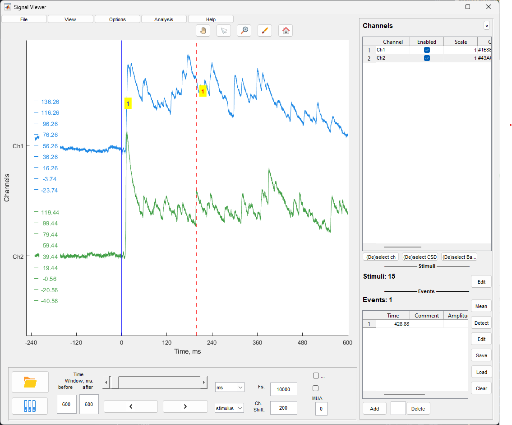
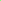

# Signal Viewer

The signal viewing window is designed for visualization of multi-channel LFP signals, management of events and stimuli, signal processing, and basic analysis.

## Main Window

The window consists of the following elements:

- **Graphical area** - display of multi-channel signals
- **Side panel** - channel, stimulus, and event settings
- **Time control panel** - data navigation
- **Menus** - File, View, Options, Analysis

## Loading Files

### Loading ZAV File

To load a file in ZAV format (.mat), use:

- **Load .mat File** button on the toolbar
- Menu **File/Open ZAV(.mat) file**

After selecting a file, a selection dialog opens. On first load, signals are displayed on all channels by default.

### Loading EV File

To load events in EV format (.ev), use:

- **Load Events** button on the toolbar
- Menu **File/Open event (.ev) file**

After selecting a file, LFP data for corresponding events and the events themselves are loaded. Events are displayed in the events table on the side panel.

### Saving File

To save the current file, use menu **File/Save ZAV(.mat) file**. All channel settings, events, and stimuli are saved.

## Time Management and Navigation

### Time Slider

The slider at the bottom of the window allows navigation along the time axis of the data. Dragging the slider changes the displayed time interval.

### Time Units

The time units dropdown allows selection of:

- **s** - seconds
- **ms** - milliseconds
- **min** - minutes

The selected unit is applied to all time parameters and time axis display.

### View Mode

The view mode dropdown determines the reference point for navigation:

- **time** - regular time
- **stimulus** - navigation by stimuli
- **event** - navigation by events
- **sweep** - navigation by sweeps

When stimulus/event/sweep mode is selected, the slider and navigation buttons move between corresponding points.

### Time Window

The **before** and **after** fields define the size of the time window displayed around the current point. Values are specified in the selected units.

### Navigation Buttons

The **Previous** and **Next** buttons move the displayed interval one step backward or forward. Step size is determined by the time window size.

### Additional Parameters

- **Fs** - sampling frequency of the displayed signal. Changing the value applies to the display.
- **Ch. Shift** - vertical offset between channels in signal amplitude units.

## Channel Settings

The side panel contains a channel settings table. Each channel has the following parameters:

- **Channel** - channel name (not editable)
- **Enabled** - enable/disable channel display
- **Scale** - amplitude scaling coefficient
- **Color** - signal line color
- **Line Width** - line thickness
- **Averaging** - channel participation in averaging for mean subtraction
- **CSD** - channel participation in CSD calculation
- **Filter** - application of filtering to the channel
- **Baseline** - baseline subtraction

### Quick Channel Management

Buttons below the channel table:

- **(De)select ch** - toggle visibility of all channels
- **(De)select CSD** - toggle participation of all channels in CSD
- **(De)select Baseline** - toggle baseline subtraction for all channels

### Hiding Side Panel

The **×** button at the top of the side panel hides the panel to increase the graph area. The **□** button restores the panel.

Alternatively, use menu **View/Hide Channel Settings** or **View/show Channel Settings**.

## Event Management

### Events Table

The events table is displayed in the lower part of the side panel. Contains columns:

- **Time** - event timestamp
- **Comment** - event comment

### Adding Event

To add an event:

- Press the **Add Event** button below the events table
- Or hold **Ctrl** and click the mouse on the graph at the desired point

Event addition behavior depends on manual addition settings (see "Manual Event Addition Settings" section).

### Deleting Event

- Select an event in the table (enter the number in the field below the table)
- Press the **Delete Event** button

The **Clear Table** button removes all events from the table.

### Manual Event Addition Settings

Menu **Options/Manual events settings** opens the settings window:

- **Detection Mode**:
  - **manual** - event is added at the specified point
  - **locked** - event is corrected to local extremum in the specified window
- **Channel Number** - channel number for adding event
- **Polarity** - extremum search polarity (positive/negative)
- **Time Window** - extremum search time window in milliseconds (for locked mode)

### Automatic Event Detection

Menu **Analysis/Autodetection** or **Auto Event Detection** button opens the automatic event detection window.

Detection parameters:

- **Detection Type**:
  - **one channel positive** - detection of positive peaks on one channel
  - **one channel negative** - detection of negative peaks on one channel
  - **two channels difference** - detection based on difference between two channels
- **Minimal Peak Amplitude** - minimum peak amplitude
- **Positive Channel** / **Negative Channel** - channels for two channels mode
- **Minimal Time Between Peaks** - minimum time between peaks
- **Smooth Coefficient** - signal smoothing coefficient
- **Detection Mode** - peaks or onsets

The **Check Detection** button shows preliminary results on the graph. The **Apply** button applies detection and adds events to the table.

### Editing Events

Menu **Options/Edit events** opens the events editing window. Allows changing event timestamps and comments.

### Saving and Loading Events

Events are automatically saved when saving a ZAV file. For separate event saving, use the **Save Events** button below the events table.

## Stimulus Management

### Stimuli Table

Stimuli are displayed in the middle part of the side panel. The list shows stimulus timestamps.

### Editing Stimuli

The **Edit** button next to the "Stimuli" header or menu **Options/Edit stimulus times** opens the stimulus timestamp editing window.

### Hiding Stimuli

Menu **View/Hide stimulus** hides or shows stimulus display on the graph.

### Importing Events from Stimuli

Menu **Options/Import events from stimulus** creates events based on stimulus timestamps.

## Signal Processing

### Filtering

Menu **Options/Filtering** opens the filtering settings window.

The left panel contains a list of channels with checkboxes for selecting channels for filtering.

The right panel contains filter parameters:

- **Filter Type** - filter type:
  - **bandpass** - bandpass filter
  - **lowpass** - lowpass filter
  - **highpass** - highpass filter
- **Lower Frequency** - lower frequency limit (Hz)
- **Upper Frequency** - upper frequency limit (Hz)
- **Filter Order** - filter order

**Select ALL** and **Deselect ALL** buttons control channel selection.

The **Check Filtration** button shows the filter frequency response on the graph at the bottom of the window.

**Apply** and **Cancel** buttons apply or cancel settings.

### Mean Subtraction

Menu **Options/Average subtraction** opens the mean subtraction settings window.

The left panel contains a list of channels with checkboxes. Selected channels participate in calculating the mean value, which is then subtracted from each channel.

**Select ALL** and **Deselect ALL** buttons control channel selection.

The **Apply** button applies settings.

### CSD Display

Menu **View/CSD displaying** or **CSD** checkbox on the toolbar opens the CSD (Current Source Density) settings window.

The left panel contains a list of channels with checkboxes for selecting channels for CSD calculation.

Visualization parameters:

- **Contrast Coef.** - display contrast coefficient
- **Smooth Coef.** - smoothing coefficient

**Select ALL** and **Deselect ALL** buttons control channel selection.

The **Apply** button applies settings.

### Artifact Removal

Menu **Options/Removal of Artifacts** opens the artifact removal settings window.

The **Artifact Window (ms)** parameter sets the size of the time window after stimulus that is excluded from display.

### MUA Display

The **MUA** checkbox on the toolbar enables multi-unit activity display.

The **MUA coef** field sets the display threshold in standard deviation units.

## Mean Trace by Events

Menu **Options/Mean Events** opens the settings window for averaging signal around events.

Parameters:

- **Time Window** - time window around event
- **Remove Baseline** - baseline subtraction
- **Remove Artifact** - artifact removal
- **Artifact Window** - artifact window size
- **Show Original Traces** - show original traces
- **Auto Scale** - automatic scaling

The **Calculate** button builds the averaged signal graph.

## File Menu

- **Open ZAV(.mat) file** - open ZAV file
- **Open event (.ev) file** - open events file
- **Save ZAV(.mat) file** - save current file
- **File manager** - open file manager
- **Open figure** - open saved figure
- **Import** - import data (ABF, NLX, Open Ephys, ZAV)
- **Save figure snapshot** - save graph snapshot

## View Menu

- **Close all windows** - close all windows
- **Hide Channel Settings** / **show Channel Settings** - hide/show side panel
- **Hide stimulus** - hide/show stimuli
- **Lines and styles** - event and stimulus line style settings
- **CSD displaying** - CSD settings
- **Built-in Zoom** - activate built-in zoom
- **Built-in Pan** - activate built-in pan
- **Data Cursor** - activate data cursor

## Options Menu

- **Manual events settings** - manual event addition settings
- **Removal of Artifacts** - artifact removal settings
- **Average subtraction** - mean subtraction settings
- **Filtering** - filtering settings
- **Edit events** - edit events
- **Edit stimulus times** - edit stimuli
- **Mean Events** - averaging by events
- **Reset record's settings** - reset all record settings

## Analysis Menu

- **Autodetection** - automatic event detection
- **Z-score** - Z-score normalization
- **Spectral Density** - power spectral density
- **Signal Analysis** - open signal analysis window
- **Cross-Correlation** - event cross-correlation
- **PCA** - principal component analysis
- **Data Operations** - channel data operations
- **Compare average data** - compare averaged data
- **Boxplot from Table** - build boxplots from table

## Keyboard Shortcuts

- **Ctrl + click** - add event at click point
- **Left/Right arrows** - time navigation (depending on view mode)

