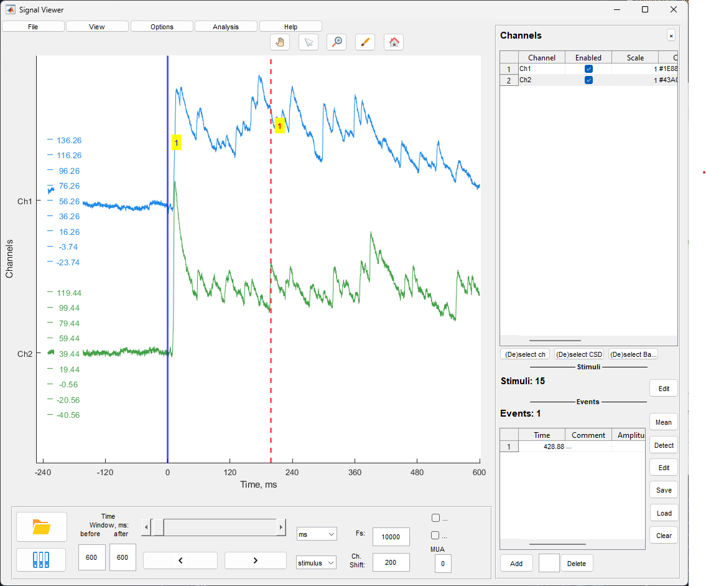

# Signal Viewer

Окно просмотра сигналов предназначено для визуализации многоканальных LFP сигналов, управления событиями и стимулами, обработки сигналов и базового анализа.

## Основное окно

Окно состоит из следующих элементов:

- **Графическая область** - отображение многоканальных сигналов
- **Боковая панель** - настройки каналов, стимулов и событий
- **Панель управления временем** - навигация по данным
- **Меню** - File, View, Options, Analysis

## Загрузка файлов

### Загрузка ZAV файла

Для загрузки файла в формате ZAV (.mat) используйте:

- Кнопку **Load .mat File** на панели инструментов
- Меню **File/Open ZAV(.mat) file**

После выбора файла откроется диалог выбора. При первой загрузке файла сигналы отображаются на всех каналах по умолчанию.

### Загрузка EV файла

Для загрузки событий в формате EV (.ev) используйте:

- Кнопку **Load Events** на панели инструментов
- Меню **File/Open event (.ev) file**

После выбора файла загружаются LFP данные для соответствующих событий и сами события. События отображаются в таблице событий на боковой панели.

### Сохранение файла

Для сохранения текущего файла используйте меню **File/Save ZAV(.mat) file**. Сохраняются все настройки каналов, события и стимулы.

## Управление временем и навигация

### Слайдер времени

Слайдер в нижней части окна позволяет перемещаться по временной оси данных. Перетаскивание ползунка изменяет отображаемый временной интервал.

### Единицы измерения времени

Выпадающий список единиц измерения позволяет выбрать:
- **s** - секунды
- **ms** - миллисекунды  
- **min** - минуты

Выбранная единица применяется ко всем временным параметрам и отображению на оси времени.

### Режим просмотра

Выпадающий список режима просмотра определяет точку отсчета для навигации:

- **time** - обычное время
- **stimulus** - навигация по стимулам
- **event** - навигация по событиям
- **sweep** - навигация по свипам

При выборе режима стимул/событие/свип слайдер и кнопки навигации перемещаются между соответствующими точками.

### Временное окно

Поля **before** и **after** определяют размер временного окна отображаемого вокруг текущей точки. Значения задаются в выбранных единицах измерения.

### Кнопки навигации

Кнопки **Previous** и **Next** перемещают отображаемый интервал на один шаг назад или вперед. Размер шага определяется размером временного окна.

### Дополнительные параметры

- **Fs** - частота дискретизации отображаемого сигнала. Изменение значения применяется к отображению.
- **Ch. Shift** - величина вертикального смещения между каналами в единицах амплитуды сигнала.

## Настройки каналов

Боковая панель содержит таблицу настроек каналов. Каждый канал имеет следующие параметры:

- **Channel** - название канала (не редактируется)
- **Enabled** - включение/выключение отображения канала
- **Scale** - коэффициент масштабирования амплитуды
- **Color** - цвет линии сигнала
- **Line Width** - толщина линии
- **Averaging** - участие канала в усреднении для вычитания среднего
- **CSD** - участие канала в расчете CSD
- **Filter** - применение фильтрации к каналу
- **Baseline** - вычитание базовой линии

### Быстрое управление каналами

Кнопки под таблицей каналов:

- **(De)select ch** - переключение видимости всех каналов
- **(De)select CSD** - переключение участия всех каналов в CSD
- **(De)select Baseline** - переключение вычитания базовой линии для всех каналов

### Скрытие боковой панели

Кнопка **×** в верхней части боковой панели скрывает панель для увеличения области графика. Кнопка **□** восстанавливает панель.

Альтернативно используйте меню **View/Hide Channel Settings** или **View/show Channel Settings**.

## Управление событиями

### Таблица событий

Таблица событий отображается в нижней части боковой панели. Содержит колонки:

- **Time** - временная метка события
- **Comment** - комментарий к событию

### Добавление события

Для добавления события:

- Нажмите кнопку **Add Event** под таблицей событий
- Или зажмите **Ctrl** и кликните мышью на графике в нужной точке

Поведение добавления события зависит от настроек ручного добавления (см. раздел "Настройки ручного добавления событий").

### Удаление события

- Выберите событие в таблице (введите номер в поле под таблицей)
- Нажмите кнопку **Delete Event**

Кнопка **Clear Table** удаляет все события из таблицы.

### Настройки ручного добавления событий

Меню **Options/Manual events settings** открывает окно настроек:

- **Detection Mode**:
  - **manual** - событие добавляется в указанную точку
  - **locked** - событие корректируется к локальному экстремуму в заданном окне
- **Channel Number** - номер канала для добавления события
- **Polarity** - полярность поиска экстремума (positive/negative)
- **Time Window** - временное окно поиска экстремума в миллисекундах (для режима locked)

### Автоматическое обнаружение событий

Меню **Analysis/Autodetection** или кнопка **Auto Event Detection** открывает окно автоматического обнаружения событий.

Параметры детекции:

- **Detection Type**:
  - **one channel positive** - обнаружение положительных пиков на одном канале
  - **one channel negative** - обнаружение отрицательных пиков на одном канале
  - **two channels difference** - обнаружение на основе разницы между двумя каналами
- **Minimal Peak Amplitude** - минимальная амплитуда пика
- **Positive Channel** / **Negative Channel** - каналы для режима two channels
- **Minimal Time Between Peaks** - минимальное время между пиками
- **Smooth Coefficient** - коэффициент сглаживания сигнала
- **Detection Mode** - peaks (пики) или onsets (онсеты)

Кнопка **Check Detection** показывает предварительные результаты на графике. Кнопка **Apply** применяет обнаружение и добавляет события в таблицу.

### Редактирование событий

Меню **Options/Edit events** открывает окно редактирования событий. Позволяет изменять временные метки и комментарии событий.

### Сохранение и загрузка событий

События сохраняются автоматически при сохранении ZAV файла. Для отдельного сохранения событий используйте кнопку **Save Events** под таблицей событий.

## Управление стимулами

### Таблица стимулов

Стимулы отображаются в средней части боковой панели. Список показывает временные метки стимулов.

### Редактирование стимулов

Кнопка **Edit** рядом с заголовком "Stimuli" или меню **Options/Edit stimulus times** открывает окно редактирования временных меток стимулов.

### Скрытие стимулов

Меню **View/Hide stimulus** скрывает или показывает отображение стимулов на графике.

### Импорт событий из стимулов

Меню **Options/Import events from stimulus** создает события на основе временных меток стимулов.

## Обработка сигналов

### Фильтрация

Меню **Options/Filtering** открывает окно настройки фильтрации.

Левая панель содержит список каналов с чекбоксами для выбора каналов фильтрации.

Правая панель содержит параметры фильтра:

- **Filter Type** - тип фильтра:
  - **bandpass** - полосовой фильтр
  - **lowpass** - низкочастотный фильтр
  - **highpass** - высокочастотный фильтр
- **Lower Frequency** - нижняя граница частоты (Гц)
- **Upper Frequency** - верхняя граница частоты (Гц)
- **Filter Order** - порядок фильтра

Кнопки **Select ALL** и **Deselect ALL** управляют выбором каналов.

Кнопка **Check Filtration** показывает частотную характеристику фильтра на графике в нижней части окна.

Кнопки **Apply** и **Cancel** применяют или отменяют настройки.

### Вычитание среднего

Меню **Options/Average subtraction** открывает окно настройки вычитания среднего значения.

Левая панель содержит список каналов с чекбоксами. Выбранные каналы участвуют в расчете среднего значения, которое затем вычитается из каждого канала.

Кнопки **Select ALL** и **Deselect ALL** управляют выбором каналов.

Кнопка **Apply** применяет настройки.

### Отображение CSD

Меню **View/CSD displaying** или чекбокс **CSD** на панели инструментов открывает окно настройки CSD (Current Source Density).

Левая панель содержит список каналов с чекбоксами для выбора каналов расчета CSD.

Параметры визуализации:

- **Contrast Coef.** - коэффициент контрастности отображения
- **Smooth Coef.** - коэффициент сглаживания

Кнопки **Select ALL** и **Deselect ALL** управляют выбором каналов.

Кнопка **Apply** применяет настройки.

### Удаление артефактов

Меню **Options/Removal of Artifacts** открывает окно настройки удаления артефактов.

Параметр **Artifact Window (ms)** задает размер временного окна после стимула, которое исключается из отображения.

### Отображение MUA

Чекбокс **MUA** на панели инструментов включает отображение мультиюнитной активности.

Поле **MUA coef** задает порог отображения в единицах стандартного отклонения.

## Средний трейс по событиям

Меню **Options/Mean Events** открывает окно настройки усреднения сигнала вокруг событий.

Параметры:

- **Time Window** - временное окно вокруг события
- **Remove Baseline** - вычитание базовой линии
- **Remove Artifact** - удаление артефакта
- **Artifact Window** - размер окна артефакта
- **Show Original Traces** - показывать исходные трейсы
- **Auto Scale** - автоматическое масштабирование

Кнопка **Calculate** строит график усредненного сигнала.

## Меню File

- **Open ZAV(.mat) file** - открыть ZAV файл
- **Open event (.ev) file** - открыть файл событий
- **Save ZAV(.mat) file** - сохранить текущий файл
- **File manager** - открыть файловый менеджер
- **Open figure** - открыть сохраненную фигуру
- **Import** - импорт данных (ABF, NLX, Open Ephys, ZAV)
- **Save figure snapshot** - сохранить снимок графика

## Меню View

- **Close all windows** - закрыть все окна
- **Hide Channel Settings** / **show Channel Settings** - скрыть/показать боковую панель
- **Hide stimulus** - скрыть/показать стимулы
- **Lines and styles** - настройки стилей линий событий и стимулов
- **CSD displaying** - настройки CSD
- **Built-in Zoom** - активация встроенного зума
- **Built-in Pan** - активация встроенного пана
- **Data Cursor** - активация курсора данных

## Меню Options

- **Manual events settings** - настройки ручного добавления событий
- **Removal of Artifacts** - настройки удаления артефактов
- **Average subtraction** - настройки вычитания среднего
- **Filtering** - настройки фильтрации
- **Edit events** - редактирование событий
- **Edit stimulus times** - редактирование стимулов
- **Mean Events** - усреднение по событиям
- **Reset record's settings** - сброс всех настроек записи

## Меню Analysis

- **Autodetection** - автоматическое обнаружение событий
- **Z-score** - Z-score нормализация
- **Spectral Density** - спектральная плотность мощности
- **Signal Analysis** - открыть окно анализа сигналов
- **Cross-Correlation** - кросс-корреляция событий
- **PCA** - анализ главных компонент
- **Data Operations** - операции с данными каналов
- **Compare average data** - сравнение усредненных данных
- **Boxplot from Table** - построение боксплотов из таблицы

## Горячие клавиши

- **Ctrl + клик** - добавление события в точке клика
- **Стрелки влево/вправо** - навигация по времени (в зависимости от режима просмотра)

