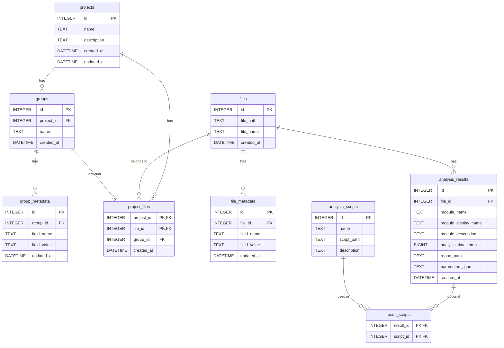

# SQL lite database

#### `projects`
```sql
id INTEGER PRIMARY KEY
name TEXT NOT NULL
description TEXT
created_at DATETIME DEFAULT CURRENT_TIMESTAMP
updated_at DATETIME DEFAULT CURRENT_TIMESTAMP
```

#### `groups`
```sql
id INTEGER PRIMARY KEY
project_id INTEGER NOT NULL REFERENCES projects(id) ON DELETE CASCADE
name TEXT NOT NULL
created_at DATETIME DEFAULT CURRENT_TIMESTAMP
```

#### `group_metadata`
```sql
id INTEGER PRIMARY KEY
group_id INTEGER NOT NULL REFERENCES groups(id) ON DELETE CASCADE
field_name TEXT NOT NULL
field_value TEXT
updated_at DATETIME DEFAULT CURRENT_TIMESTAMP
UNIQUE(group_id, field_name)
```

#### `files`
```sql
id INTEGER PRIMARY KEY
file_path TEXT NOT NULL
file_name TEXT NOT NULL
created_at DATETIME DEFAULT CURRENT_TIMESTAMP
UNIQUE(file_path, file_name)
```

#### `project_files` (many-to-many)
```sql
project_id INTEGER NOT NULL REFERENCES projects(id) ON DELETE CASCADE
file_id INTEGER NOT NULL REFERENCES files(id) ON DELETE CASCADE
group_id INTEGER REFERENCES groups(id) ON DELETE SET NULL
created_at DATETIME DEFAULT CURRENT_TIMESTAMP
PRIMARY KEY (project_id, file_id)
```

#### `file_metadata`
```sql
id INTEGER PRIMARY KEY
file_id INTEGER REFERENCES files(id) ON DELETE SET NULL
field_name TEXT NOT NULL
field_value TEXT
updated_at DATETIME DEFAULT CURRENT_TIMESTAMP
UNIQUE(file_id, field_name)
```

#### `analysis_results`
```sql
id INTEGER PRIMARY KEY
file_id INTEGER REFERENCES files(id) ON DELETE SET NULL
module_name TEXT NOT NULL
module_display_name TEXT
module_description TEXT
analysis_timestamp BIGINT NOT NULL
report_path TEXT NOT NULL
parameters_json TEXT
created_at DATETIME DEFAULT CURRENT_TIMESTAMP
```

#### `analysis_scripts`
```sql
id INTEGER PRIMARY KEY
name TEXT NOT NULL
script_path TEXT NOT NULL
description TEXT
UNIQUE(script_path)
```

#### `result_scripts` 
```sql
result_id INTEGER NOT NULL REFERENCES analysis_results(id) ON DELETE CASCADE
script_id INTEGER NOT NULL REFERENCES analysis_scripts(id) ON DELETE CASCADE
PRIMARY KEY (result_id, script_id)
```

## Table Relationships


